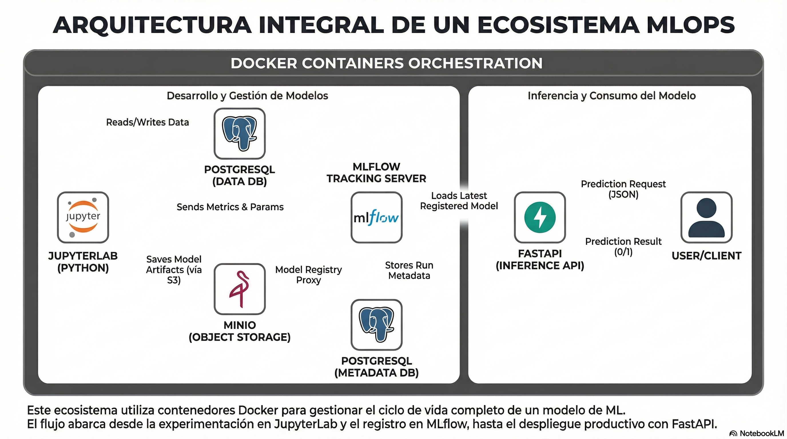
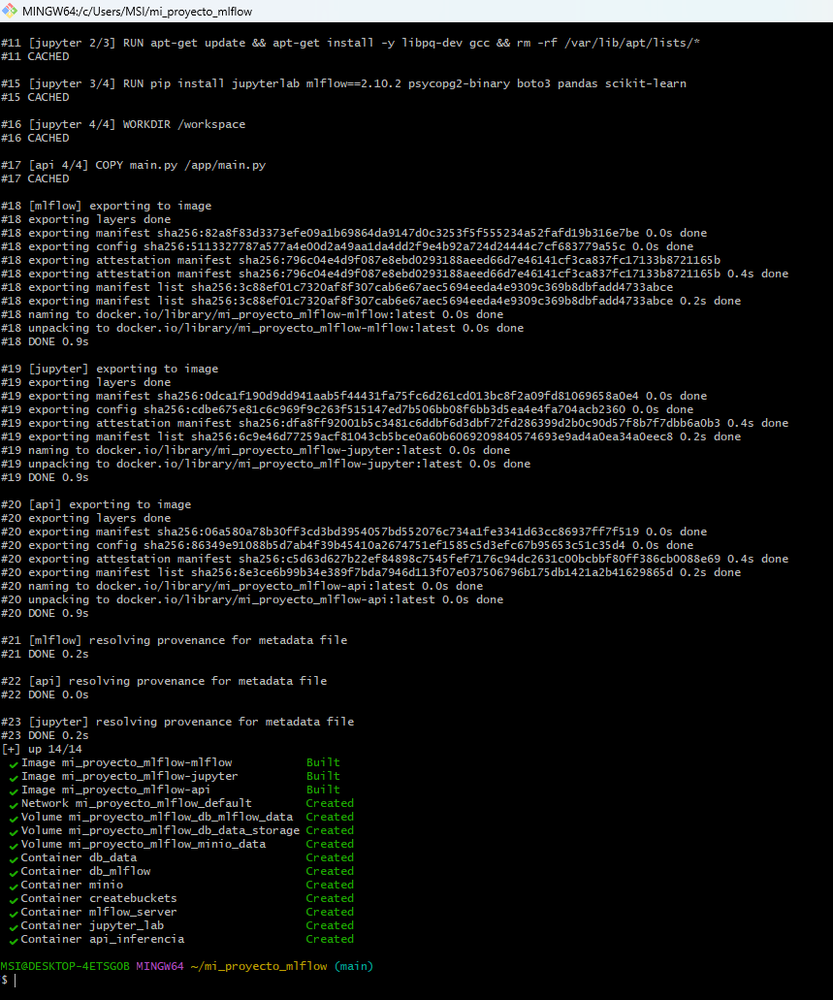
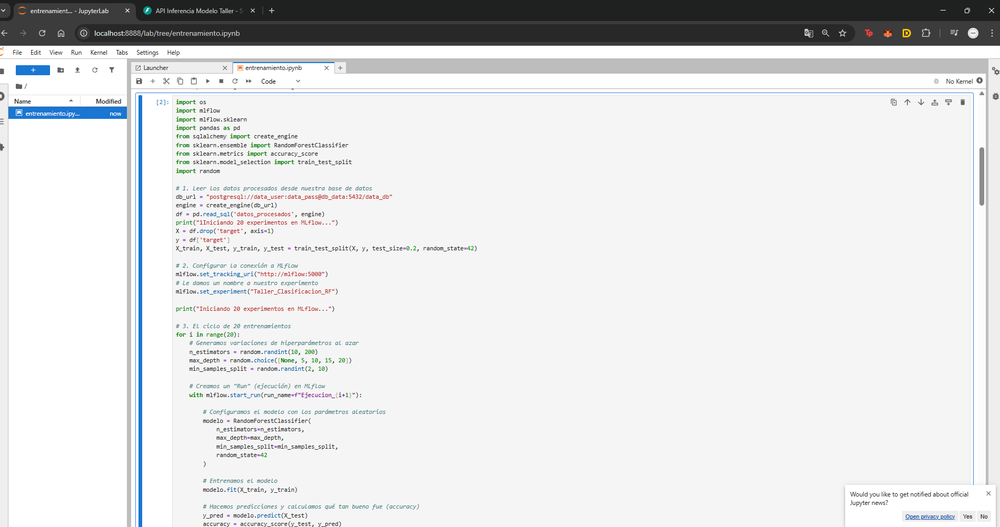
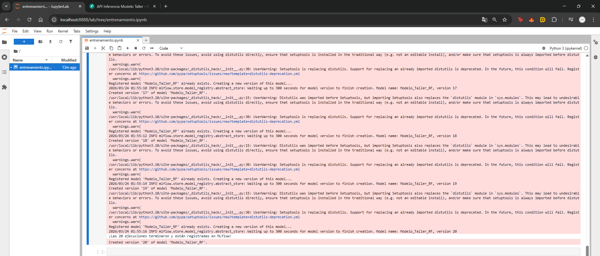
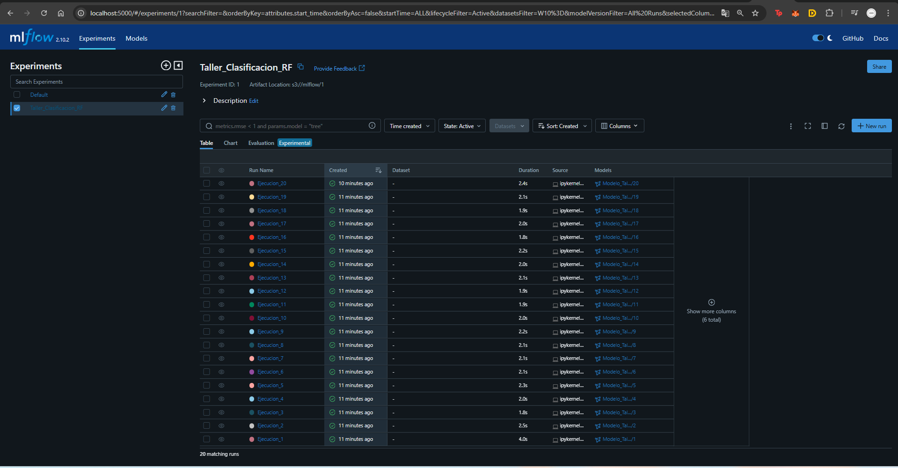
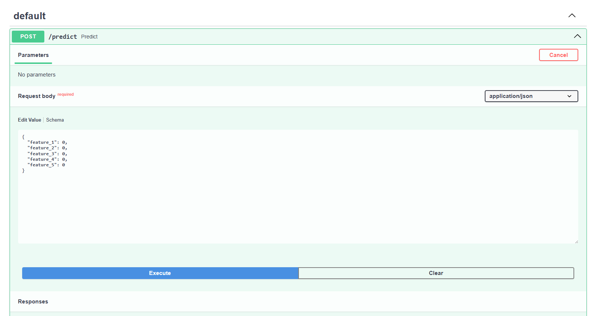
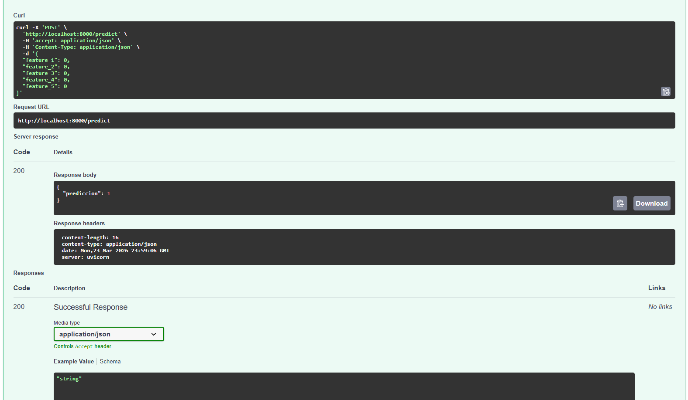

# Taller MlFlow

Este proyecto es una implementación completa de un ecosistema de Machine Learning utilizando contenedores Docker. Cumple con el ciclo de vida completo de un modelo de ML: desde el almacenamiento de datos en bruto, pasando por la experimentación y registro de modelos, hasta su despliegue mediante una API REST.

---

## Arquitectura y Flujo del Proceso

El proyecto está diseñado bajo una arquitectura de microservicios. A continuación se presenta el diagrama general del flujo de trabajo:

> **[Nota para el autor: Inserta aquí la imagen del diagrama de arquitectura cuando la generes]**
> 

### Componentes Principales:
1. **Bases de Datos (PostgreSQL):** * `db_mlflow`: Dedicada exclusivamente a guardar la metadata de MLflow.
   * `db_data`: Dedicada a almacenar los datos crudos y los datos procesados que consumirá el modelo.
2. **MinIO (Object Storage):** Configurado como servidor S3 local para almacenar los "artefactos" (el modelo físico y sus dependencias) generados por MLflow.
3. **MLflow Server:** El corazón del tracking. Registra los parámetros, métricas y versiones de los modelos de cada experimento.
4. **JupyterLab:** Nuestro entorno de desarrollo interactivo (IDE). Aquí se ejecuta la ingesta de datos a la base de datos y se entrena el modelo de *Random Forest*.
5. **FastAPI:** El servicio de inferencia. Se conecta a MLflow al arrancar, descarga la última versión del modelo registrado y expone un endpoint para predecir sobre nuevos datos.

---

##  Requisitos Previos

Para ejecutar este taller, necesitas tener instalado en tu máquina:
* Docker y Docker Compose.
* Git (opcional, para clonar el repositorio).

---

## 📖 Paso a Paso para la Ejecución

Sigue estos pasos cuidadosamente para levantar la infraestructura y replicar los experimentos.

### Paso 1: Configurar Variables de Entorno
Crea un archivo llamado `.env` en la raíz del proyecto y agrega las credenciales necesarias para las bases de datos y MinIO:

```env
MINIO_ROOT_USER=admin
MINIO_ROOT_PASSWORD=password123
POSTGRES_USER_MLFLOW=mlflow_user
POSTGRES_PASSWORD_MLFLOW=mlflow_pass
POSTGRES_DB_MLFLOW=mlflow_db
POSTGRES_USER_DATA=data_user
POSTGRES_PASSWORD_DATA=data_pass
POSTGRES_DB_DATA=data_db
```
### Paso 2: Levantar la Infraestructura
Abre una terminal en la raíz del proyecto y ejecuta el siguiente comando para construir y encender todos los contenedores en segundo plano:

Bash
docker compose up -d --build
Nota: La primera vez puede tardar unos minutos mientras descarga y construye las imágenes de Python, MLflow, Jupyter y FastAPI.
> 

### Paso 3: Entrenamiento y Experimentación
Una vez que los contenedores estén corriendo, ingresa a JupyterLab a través de tu navegador en:
 http://localhost:8888

Allí encontrarás el notebook entrenamiento.ipynb. Al ejecutar sus celdas, ocurrirá lo siguiente:

Se generarán datos crudos y procesados que se guardarán directamente en la base de datos PostgreSQL (db_data).

Se iniciará un ciclo de 20 experimentos utilizando un modelo RandomForestClassifier, variando sus hiperparámetros aleatoriamente en cada ejecución.
> 

> 

### Paso 4: Monitoreo en MLflow
Para ver el registro de todas las ejecuciones, métricas obtenidas y el modelo final registrado, ingresa al servidor de MLflow en:
 http://localhost:5000

En la sección de experimentos, verás las 20 iteraciones, lo que permite comparar rápidamente cuál combinación de hiperparámetros arrojó la mejor precisión (accuracy). El modelo queda guardado bajo el nombre Modelo_Taller_RF.
> 


### Paso 5: Despliegue e Inferencia (FastAPI)
La API ya se encuentra corriendo en el puerto 8000. FastAPI se encargó de descargar la última versión del modelo desde MLflow automáticamente al iniciar.

Para probar la inferencia, accede a la documentación interactiva de Swagger:
 http://localhost:8000/docs

En la ruta /predict, puedes enviar un JSON con los valores de las 5 features esperadas por el modelo.
> 


Al presionar "Execute", la API procesará los datos a través del modelo Random Forest descargado y devolverá la predicción (ej. {"prediccion": 1}).

> 
> 
###  Limpieza del Entorno
Si deseas apagar la infraestructura y eliminar los contenedores y redes creadas, ejecuta en tu terminal:

Bash
docker compose down
(Si también deseas borrar los volúmenes con los datos de las bases de datos y MinIO, añade el flag -v: docker compose down -v).
